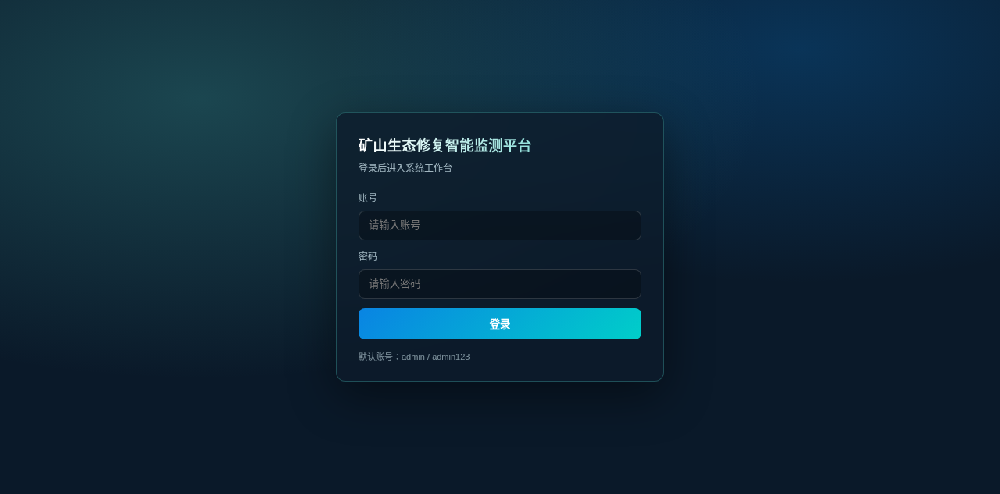
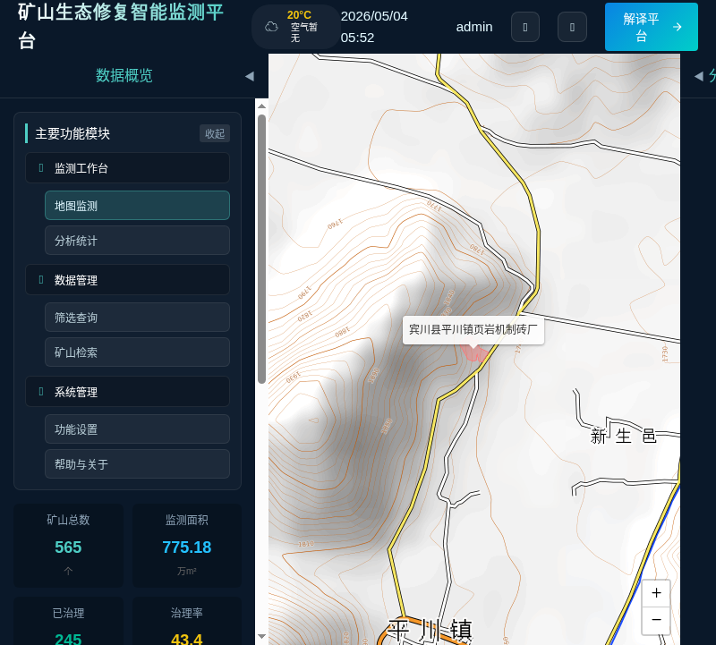
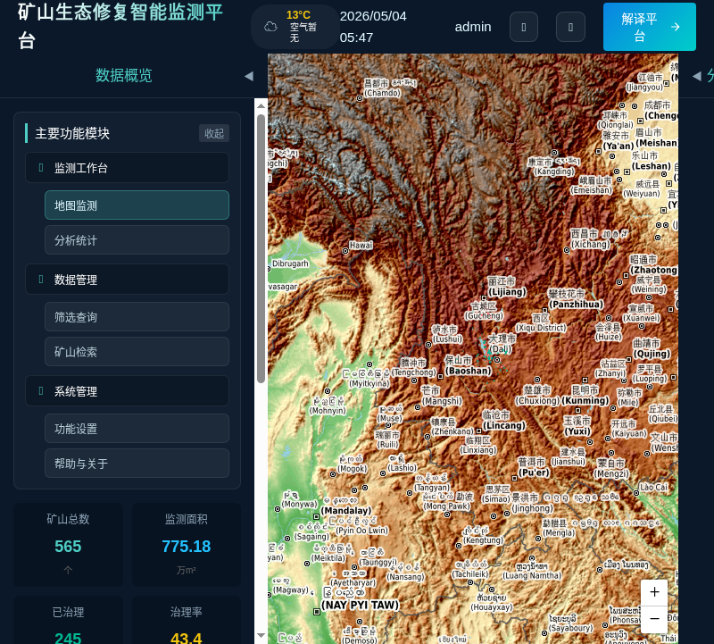
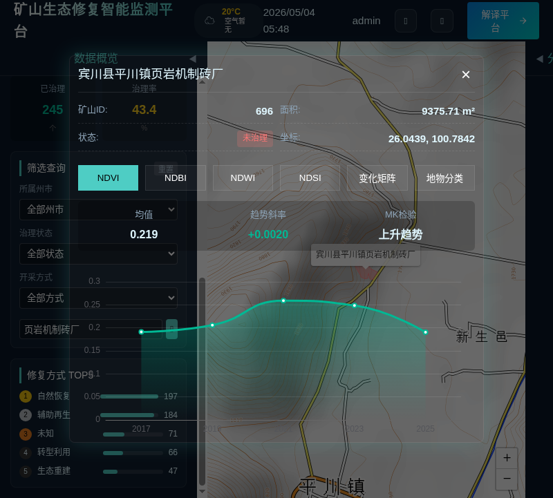
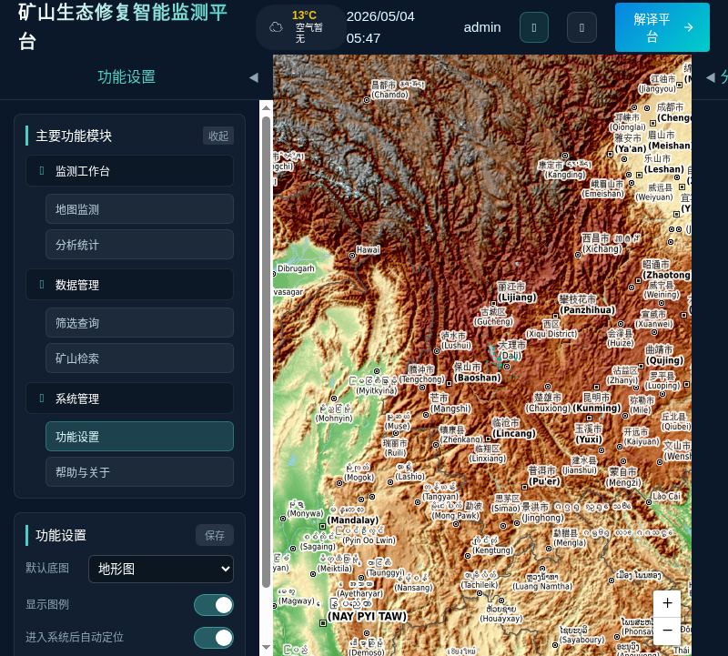

# 矿山生态修复智能监测平台 使用手册

## 1. 登录

1. 打开前端地址（开发环境通常为 `http://localhost:5173/`）。
2. 输入账号与密码后点击“登录”进入系统。

默认账号：
- 账号：admin
- 密码：admin123

## 2. 主界面与主要功能模块

登录成功后进入系统工作台，界面由四个区域构成：
- 顶部栏：系统标题、日期时间、环境信息、功能入口（功能设置、退出登录、解译平台跳转）。
- 左侧栏：主要功能模块导航（一级功能 + 二级菜单），以及与当前模块相关的操作面板。
- 中央地图：矿山分布与交互（底图切换、点击/检索定位、图例）。
- 右侧栏：统计分析图表与概览。

下图展示了一级功能完整、二级菜单展开后的导航结构：

### 2.1 监测工作台

一级功能：监测工作台
- 地图监测：矿山空间分布展示、底图切换、图例查看、点击矿山查看详情。
- 分析统计：右侧栏展示治理状态分布、修复后地类、开采方式统计等。

### 2.2 数据管理

一级功能：数据管理
- 筛选查询：按“所属州市 / 治理状态 / 开采方式”等条件筛选矿山范围。
- 矿山检索：按关键字或编号检索矿山，并自动定位到目标矿山。

### 2.3 系统管理

一级功能：系统管理
- 功能设置：配置默认底图、是否显示图例、是否自动定位等。
- 帮助与关于：查看系统说明与用途简介。

## 3. 典型操作流程（从登录到查看矿山详情）

### 3.1 筛选查询

1. 在左侧“筛选查询”面板中选择“所属州市 / 治理状态 / 开采方式”。
2. 条件会即时生效，地图上仅显示符合条件的矿山范围。
3. 点击“重置”可清空条件并恢复全量展示。

### 3.2 矿山检索与自动定位

1. 在“矿山检索”输入框中输入矿山编号（如 `696`）或名称关键词（如 `页岩机制砖厂`）。
2. 点击搜索按钮，系统会自动定位到目标矿山并打开详情窗口。

### 3.3 查看矿山详情

矿山详情弹窗支持：
- 基本信息：矿山 ID、面积、治理状态、坐标等。
- 指标趋势：NDVI / NDBI / NDWI / NDSI 均值、趋势斜率、MK 检验与趋势曲线。
- 变化矩阵：地物转移矩阵（按不同年份对比）。
- 地物分类：分类结果图（如已生成并存在）。

## 4. 功能设置（系统管理 → 功能设置）

“功能设置”用于个性化配置地图与交互体验，设置保存到本机浏览器，刷新或下次打开系统仍会生效。

入口：
- 顶部栏“⚙️”按钮，或
- 左侧导航“系统管理 → 功能设置”

### 4.1 默认底图

用于设置进入系统时默认展示的底图类型：
- 标准地图
- 卫星影像
- 地形图

### 4.2 显示图例

控制地图左下角图例是否显示（已治理/未治理/未知）。

### 4.3 进入系统后自动定位

控制加载数据后是否自动缩放并定位到矿山要素范围：
- 开启：进入系统后自动定位到矿山数据范围。
- 关闭：保持默认视角，便于手动浏览或固定展示。

### 4.4 保存

点击“保存”后立即生效，并写入本机浏览器存储。

